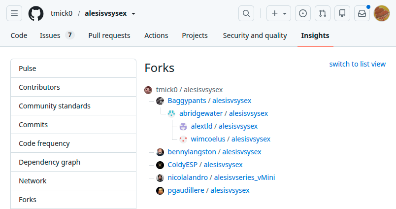
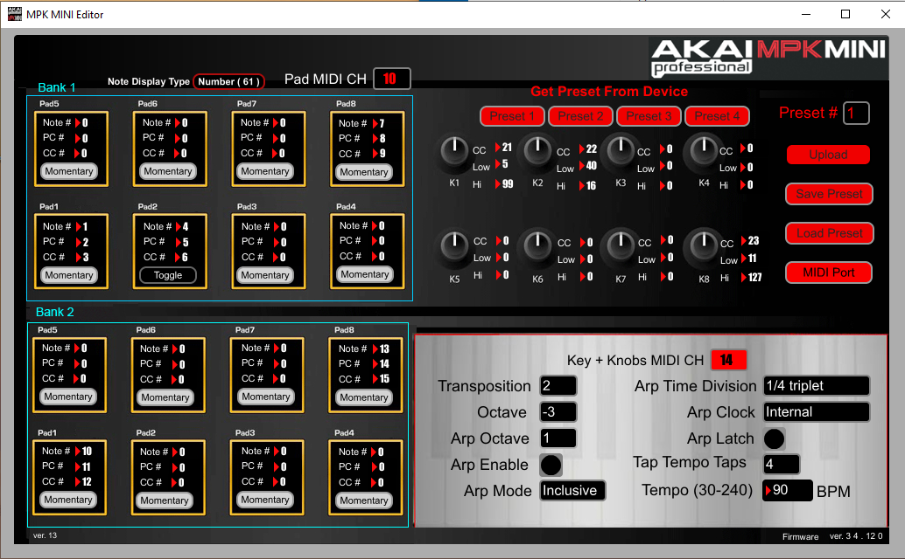

# Notes on Tim Littlefair's fork of alesisvsysex

## Background to this fork

I have forked this project from @tmick0's original GitHub project.

As at the time of writing (July 2026), the original repository had
been forked 8 times before I created this fork:

My (initial) personal motivation for adding yet a further fork is to 
see if I can add support for the Alesis V61 (original, not mkII) keyboard
which I own.

TL;DR: This document is being maintained as a chronogical log of 
thoughts and changes while I am working on this project - you can 
skip ahead to subsections
[Current Status](#current-status) and 
[Future Possibilities](#future-possibilities)
if you are not interested in tracing the historical evolution of the fork.

## Chronological Notes

### 2026/07/23

Before working on the changes I want for my own sake, I merged the 
following features implemented in prior forks on top of the latest 
commit in @tmick0's repo:

* work in the forks created by @Baggypants and @abridgewater to add 
  support for the following models:
  + VMini added by @Baggypants
  + VI49 and (possibly?) VI61 added by @abridgewater
  + VI25 added by @wimcoelus

This work is merged in a branch named wimcoelus-master as wimcoelus's
fork supporting the VI25 includes all commits in the prior forks from 
@Baggypants and @abridgewater.

I've looked at the commits in the other forks belonging to @alextld, 
@bennylangston, @ColdyESP, @nicolalandro and @pgaudillere.  For the 
moment I don't see anything in any of these which looks of immediate 
value to merge, but I'd be happy to merge future work from any of 
those contributors if they are prepared to rebase against the tip of 
my repo.

In the event that I am able to successfully add support for my V61 
model, I will try to generate a useable pull request for consumption
by @tmick0 should he choose to accept it and bring support for the
widest range of devices possible back to the root of the tree 
of forks.

I may also consider whether it is possible to continue and add 
support for the Akai MPK Mini (original) model, as I own this, and 
the excellent reverse engineering documentation generated and linked
by earlier contributors to this tree of forks would appear to make
this extension beyond the Alesis brand feasible. 

### 2026/07/27

At my first attempt to modify the codebase with @Baggypants' and @abridgewater's
changes merged in to add V61 support I found that performing either a 
'load from file' or 'load from device' operation with my changes caused 
the application to open a second top level window rather than load the 
config found in the selected file or device into the existing window.

As I don't have access to any of the devices which were already supported
in the other forks, I wasn't able to work out whether this was a consequence
of the changes I'd made to support V61 or whether it was introduced by one or other
of the forks.

I reverted to the last commit on @tmick0's original repository, and found that 
I was able to make a fairly simple set of changes to that baseline to enable 
the V61 to be recognized instead of the V25, and to extend the enumeration 
classes for pad and button modes so that each now includes an entry for 
the program change mode.  These changes are in commit 
[1a2fa60](https://github.com/tim-littlefair/alesisvsysex/commit/1a2fa60449c95bc9e66b6e1514f8bbe5d8f60a7e).

With this commit I was able to load parameters from my V61, save them to 
file and reload.  

I did some further work to enable the program to scan for multiple prefixes so 
that I could restore interoperability with the original V25 device supported
in @tmick0's baseline.  I also speculatively added support for the V49 (based
on the reasonable assumption that the product id would be 0x42, given that V25 
has 0x41 and V61 has 0x43).  I am unable to test either V25 or V61 and would 
welcome testing comments (positive or negative) from anyone who owns either 
of these and is prepared to try this work out.  The work described in this 
paragraph is present in commit
[d8d1d95](https://github.com/tmick0/alesisvsysex/commit/d8d1d954f337fce0fea83193c1276692099799ee).

As of the commit referenced above, I believe that my codebase could potentially be 
used as the basis for a pull request to resolve 
[issue #5 raised against @tmick0's repository](https://github.com/tmick0/alesisvsysex/issues/5).

This is not a minimal fix, as I don't have access to a V25 device, so I was obliged
to add support for my V61 device as an alternative, without which I would not have been 
able to test.

It is also deficient in relation to user experience, because the parameter labelling 
for the newly supported Program Change mode on pads and buttons just uses the same labels
as the default parameters for each control type (labels reflect 'Note' mode params for 
pads and 'CC Toggle' mode params for buttons) - but the same criticism could be made
in relation to the labelling of parameters of either control type when they are not 
in the default mode, so I don't feel this is a regression relative to @tmick0's tip baseline.

I plan to apply a tag 'vseries-mark1-program-change-support' to this baseline once
I have completed writing up this log entry and added some comments about possible next steps.

## Current Status

Program is capable of recognizing and connecting to the following
midi keyboard devices:

* Alesis V61 (confirmed)

* Alesis V25 (not yet confirmed)

* Alesis V49 (not yet confirmed)

I believe that the SysEx configuration request and reply for all of 
these devices are in the same format, with the exception of a single
byte at offset 5 into the midi message which identifies the product
(i.e. branded model) the message is being sent to or from.  For 
V61 this byte is 0x43.  For V25, from @tmick0's baseline we know this
byte is 0x41.  It seems a reasonable guess that the V49 will have 0x42 
in this position (confirmation would be very welcome).

As the length and structure of the SysEx payload containing configuration 
data is the same for all three product models supported it is unsurprising 
that the file alesisvsysex/protocol/model.py did not need to be changed
to add support for the additional device.  The baseline presently described
has not presently merged support for VMidi or VI-series devices added 
in forks of @tmick0's work as these may require more extensive reengineering
of the model section of the framework.

For all three devices, the pad and button controls are multimodal.
The pads support modes Note/CC Toggle/CC Momentary/Program Change.
The buttons (referred to in Alesis editor UI as 'switches') support
modes CC Toggle/CC Momentary/Program Change.  Note that although
the editor allows these controls to take on different modes, 
the labelling of parameters is presently fixed and reflects the 
default mode of each control type (Note mode for pads, CC Toggle 
mode for buttons).

## Future Possibilities

### Merge support for device models supported in other forks

#### Alesis VMini

Support for this was added in @Baggypants' fork, but was only added 
by removing V25 support and modifying the model to (presumably)
match the VMini only, so it no longer matches the V25 model (which 
we now know is also OK for V61 at least, and almost certainly also
V49).

Adding this as an alternative should be possible but will probably 
require the (software) model.py (class) to become a base class or
an interface with some kind of factory pattern in place to select
different model implementation classes according to the detected 
port names.

#### Alesis VI49 and other VI-series models

Support for VI49 was added in @abridgewater's fork, and they 
also appear to have implemented some kind of framework to allow
the model constructed to reflect the port names detected, 
presumably enabling a single implementation to support the 
V25 and VMini alongside the newly added VI49.

As I don't have any of these devices, I haven't been able 
to test how this framework works using @abridgewater's tip 
commit, but his fork should contain enough information for
these to be added back in once I have a framework in place
which supports different model class implementations according
to the port names detected.

### Merge support for new device models

#### AKAI Professional MPK mini

I own this device, and have saved an settings file from the first-party
Windows editor alongside this document as file 
[akai-mpk-mini-260727.txt](./akai-mpk-mini-260727.txt).

The edit window the file corresponds to contains the following configuration:
.

The settings file is human readable and appears to consist of a single midi 
SysEx message written out as a space-delimited list of unsigned single 
byte integers.  I am expecting that the artificial preset reflected in 
in the .txt and .png files mentioned above will enable me to reverse engineer
the format and implement a capability to detect this device and edit
its file under alesisvsysex.

#### Other inMusic brands

Note that 
[according to Wikipedia](https://en.wikipedia.org/wiki/InMusic_Brands)
Akai Professional and Alesis are both brand names
belonging to the same business conglomerate, now called 
inMusic Brands Inc., headquartered in Cumberland, Rhode Island. 

Both brands have been owned by inMusic's predecessor business Numark 
since 2001 and 2005 respectively, so it would not be surprising to find 
that the software framework originally implemented to interoperate with Alesis 
devices may also be adaptable to interoperate with Akai keyboards.

According to the Wikipedia reference above, inMusic Inc also own
a number of other brands include M-Audio (since 2012), Denon (since
2014) and Moog (since 2023).  It is possible that keyboards from 
these brands may be suitable for porting to the alesisvsysex format
(particularly in relation to product models released after the
acquisition by the inMusic business),

### Fix up parameter labelling for multimodal pads/buttons

The following screenshot from the V61 editor for Windows shows
how Alesis' first-party editor labels parameters in the non-default modes.

## Random useful pages:

https://github.com/tmick0/alesisvsysex/issues/2

https://lo.calho.st/posts/alesis-v-config-gui/

https://lo.calho.st/posts/reverse-engineering-sysex/

https://github.com/tmick0/alesisvsysex/issues/6

https://www.untergeek.de/2014/11/taming-arturias-beatstep-sysex-codes-for-programming-via-ipad/

https://github.com/tsmetana/mpk3-settings

https://github.com/tsmetana/mpk3-settings/issues/21

https://support.spectrasonics.net/manual/Omnisphere3HW/3/en/topic/setting-up-the-v61-mk1

https://support.spectrasonics.net/manual/Omnisphere3HW/3/en/topic/setting-up-the-mpk-mini-mk1

https://www.akaipro.com/downloads-and-support/downloads/?legacy=true

NB: The material related to MPK Mini original version is titled "MPK MINI CLASSIC"
and the associated product picture does not look at all like my MPK mini.  
The Quickstart user manual in this section does contain a picture which looks 
like my model and the software works with it.

